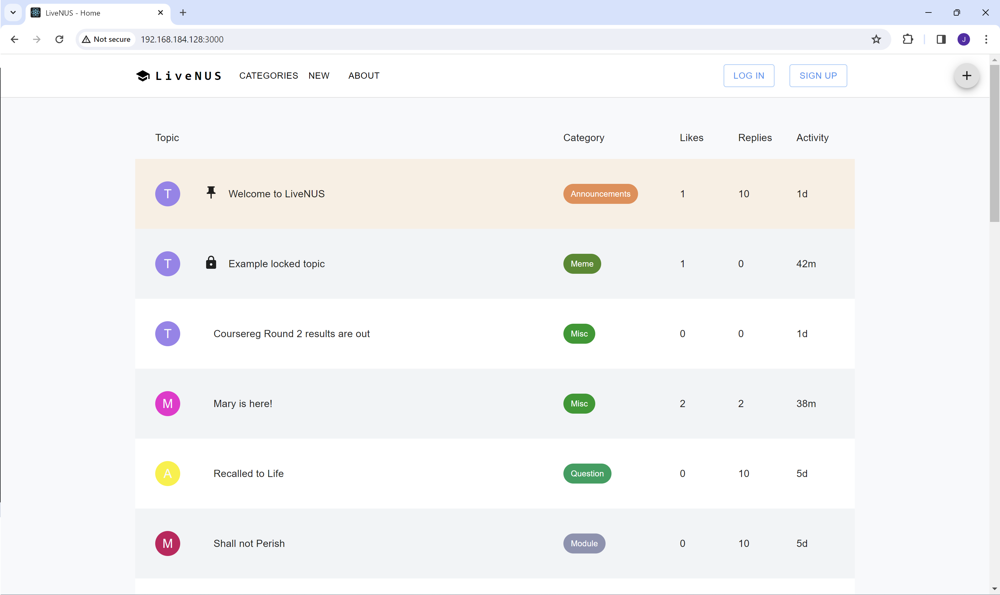
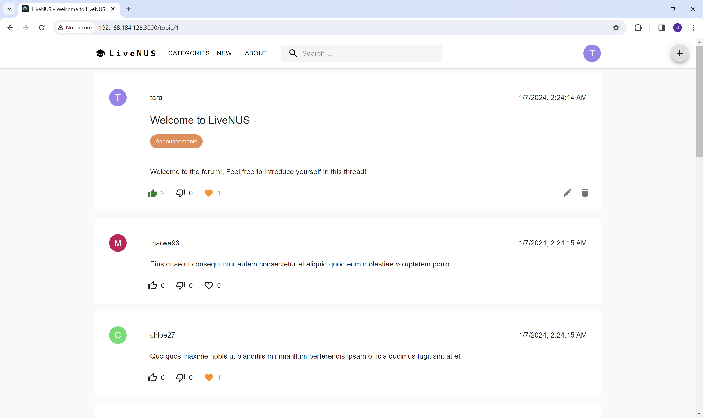
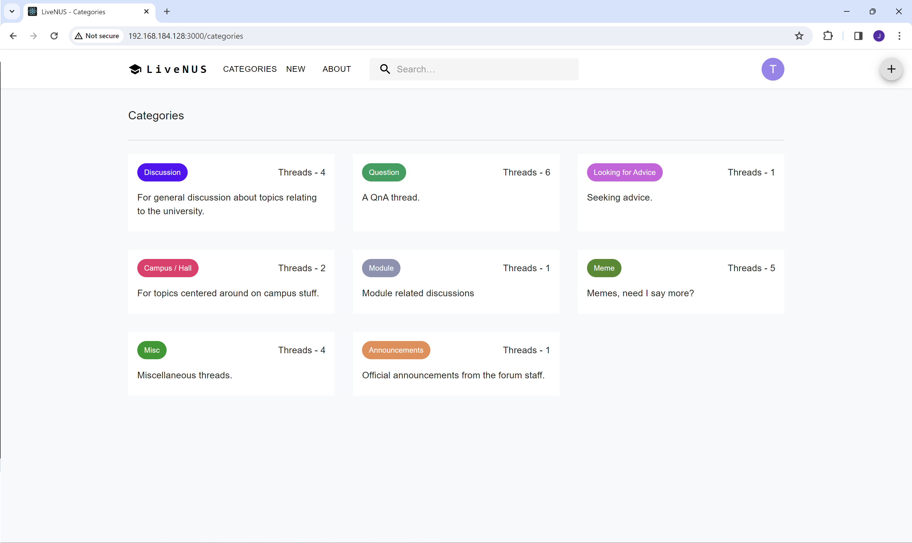

# LiveNUS Frontend

React frontend for LiveNUS forum. Designed to be deployed with [LiveNUS Server](https://github.com/Jovin-Ang/LiveNUS-Server).

## Setup and installation

### Prerequisite

Ensure [LiveNUS Server](https://github.com/Jovin-Ang/LiveNUS-Server) is already deployed.
The frontend cannot function without its backend.

### Development

To get the react frontend running locally:

1. Clone this repo.
2. Edit the api server environment variable in `.env`.
3. `yarn install` to install all required dependencies.
4. `yarn start` to run the app in development mode.
5. Open [http://localhost:3000](http://localhost:3000) to view it in the browser.

### Deployment
TBA

## Overview

This is the main file structure

```
.
├── node_modules
├── public
├── src
├── .env
├── README.md
├── tsconfig.json
├── package.json
├── .eslintrc.js
├── .prettierrc.js
└── yarn.lock
```

Main directories/files to note:

-   `src` includes LiveNUS frontend source code.
-   `.env` contains environment variables, for example, the api server address.
-   `.eslintrc.js` contains the configuration for ESLint.
-   `.prettierrc.js` contains the configuration for Prettier.

### Pages

| Page            | URI Pattern     | Detail                                                                                                                 |
|-----------------|-----------------|------------------------------------------------------------------------------------------------------------------------|
| Index           | /               | Landing page, lists all topics                                                                                         |
| New topic       | /new            | Form to create a new topic                                                                                             |
| Single topic    | /topic/:id      | Single topic view with comments, vote and like buttons.<br/>Edit and delete button will be shown for own topic/comment |
| Categories      | /categories     | Shows all categories in card format                                                                                    |
| Single category | /categories/:id | Single category view, lists all posts from that category                                                               |
| About           | /about          | About page, contains a short paragraph about the forum                                                                 |
| Login           | /login          | Landing page, lists all posts                                                                                          |
| Sign up         | /signup         | Landing page, lists all posts                                                                                          |

### Screenshots





## Issues

If you run into any issues, please open a new issue on the github repository

## Acknowledgements

This project was built upon [Sample React App](https://github.com/CVWO/sample-react-app).
This project uses [MUI](https://mui.com/),
[ESLint](https://eslint.org/), [Prettier](https://prettier.io/).
